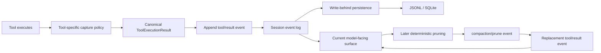

# Tool Results: Capture, Storage, Pruning, And Long Bash Jobs

This guide answers a practical question: when a tool returns a large result, what reaches the model, what enters the durable session log, what gets trimmed, and what is merely a temporary process artifact?

The answer in the pinned harness is not one behavior. It is a pipeline with separate policies:

1. The tool/executor bounds live output before it creates a result.
2. The resulting `tool/result` event is appended to the session log.
3. Persistence writes that event to JSONL or another backend on the normal durability path.
4. A later compaction policy may append a derived replacement that makes the current model-facing surface smaller.

The original session fact is never mutated in place.

## Direct Answers

| Question | Answer in this source tree |
|---|---|
| Are results used blindly? | They become ordinary model-visible tool-result messages. The runtime preserves typed tool output and truncation metadata, but this path has no generic truth checker or semantic verifier for arbitrary command output. Treat output as evidence to inspect, not authority to obey. |
| Are results scrubbed for secrets? | Not by the result-retention or compaction-pruner code shown here. Those components bound size; they are not a general secret-redaction system. A command that prints a secret can place the retained portion into session history and JSONL. |
| Are results truncated? | Often before the result is created. Bash keeps a bounded output tail and marks it `truncated`; other tools use explicit retention policies. |
| Is the full Bash output durable in JSONL? | No. JSONL records the canonical `tool/result` message the tool produced: normally the bounded text plus explicit metadata, and a spill path only when available. The spill file itself is a separate temporary process artifact, not embedded as the full output body in the session event. |
| Does pruning delete the old result? | No. The pruner appends `compaction/prune` and then a new replacement `tool/result` whose surface operation replaces the old visible node and whose `sourceEventSeqs` cites it. The earlier event remains in the append-only log. |

## The Result Lifecycle



There are two different kinds of reduction in this flow:

- **Capture-time bounding** decides what the tool returns in the first place. The omitted bytes were not retained in the canonical tool-result message.
- **Surface-time pruning** operates later on an already-durable tool result. It retains the original ledger event and adds a smaller replacement for the live context surface.

Conflating these is dangerous. A spill-file path can recover an omitted command-output prefix only while that file remains available; a compaction replacement can still trace to its original session event because that event remains in the ledger.

## Bash Output: Bounded Tail, Optional Spill, Explicit Loss

Read `packages/subprocess/subprocess-local/src/spawn.ts` first. `OutputCollector` is the low-level policy used by local subprocess execution.

### In-memory behavior

For each collected stream, it keeps at most `maxBytes` of a moving tail. When a new chunk would exceed the cap, it drops bytes from the *head* of the retained window until the window fits again. The final `stdout`/`stderr` result therefore favors the end of command output, where exit diagnostics and final summaries often appear.

The local Bash executor defaults its per-stream memory cap to `64_000` bytes. A foreground caller may request a larger `stdoutMaxBytes`, but stderr still uses the executor's configured cap. See `packages/shell/bash-local/src/index.ts`.

The result is explicit:

```ts
{
  text: "... retained tail ...",
  truncated: true,
  spillPath?: "/private/temp/file"
}
```

`truncated: true` means the collector dropped bytes due to its configured output budget. It does not mean the command itself failed, timed out, or produced incomplete data upstream.

### Spill-file behavior

When configured to spill, the collector creates a private per-process directory under the operating-system temp directory. On first in-memory overflow it creates an owner-only file (`0600`) with an unpredictable name, writes the already retained bytes, then continues writing the full stream while it remains within `maxSpillBytes`.

This is a recovery convenience, not durable session storage:

- The spill file may be removed once the spill budget is exceeded.
- The spill path is removed from the result if final close/writeback makes the file unreliable.
- It is intentionally outside the session JSONL artifact.
- A later resume must not assume the path still exists or still contains the complete stream.

The tool renders a visible notice such as `output truncated; full output: <path>` when a valid path is available. When it is not available, the loss is still disclosed as `(unavailable)`. It does not silently pretend that the retained tail is the full command output.

Relevant code and tests:

- `packages/subprocess/subprocess-local/src/spawn.ts`
- `packages/subprocess/subprocess-local/tests/spawn.spec.ts`
- `packages/shell/bash-local/src/index.ts`
- `packages/shell/tool-bash/src/index.ts`
- `packages/shell/tool-bash/tests/tools.spec.ts`
- [0032: tool output spill policy](../03-agent-context/0032-tool-output-spill-policy.md)
- [0534: rejected removal of Bash spill files](../03-agent-context/0534-drop-bash-full-output-spill-files.md)

The final note is explicitly **rejected**, which matters: it records a considered alternative, not current behavior.

## Foreground Bash Result In The Session

The Bash tool converts its typed shell result into a canonical object that includes exit code, signal, timeout/abort facts, bounded stdout and stderr, truncation flags, optional spill paths, and sandbox outcome. The tool framework then records a `tool/call` and a `tool/result` in the agent session.

Conceptually, the durable log contains this shape, with real typed IDs and event data in the actual source:

```json
{"type":"tool/call","seq":42,"data":{"message":{"source":{"callId":"call-1"}}}}
{"type":"tool/result","seq":43,"data":{"message":{"source":{"callId":"call-1"},"content":[{"type":"text","text":"... bounded Bash result ..."}]}}}
```

The logged `tool/result` is the model-facing result at that moment. If Bash output overflowed, the logged text is the tail plus its loss notice, not an unbounded hidden copy of stdout. If the result includes a spill path, that is a reference to a separate file, not an inline copy of the file's contents.

Session JSONL serializes these logical events. Its packed-row optimization is for delta-chunk runs, not an instruction to replace `tool/result` facts with arbitrary blobs. See `packages/session/session-persistence-jsonl/src/format.ts` and [0048: Zstandard JSONL](../03-agent-context/0048-zstandard-jsonl-session-logs.md).

## Results Are Not Blindly Trusted Or Mutated

The normal model request includes tool-result messages as part of derived session history. The code preserves result structure and error status; it does not run an LLM-based “is this output true?” step before making the result available.

That has two implications for a harness designer:

1. A tool result is evidence from a capability, not a universal instruction authority. Model prompts and tool contracts must make this clear, especially for outputs containing text from untrusted files, network responses, or subprocesses.
2. Secret handling must happen at the appropriate boundary: avoid emitting secrets, redact at the tool/provider boundary when policy requires it, and constrain durable session access. Size truncation is not redaction.

The source in this repository demonstrates bounded retention and explicit loss reporting. It should not be read as a complete content-security or data-loss-prevention design.

## Later Pruning: Smaller Context Without Rewriting History

The optional `compaction-tool-result-pruner` is a model-free, deterministic optimization used during compaction pressure. It does **not** remove or edit the original event.

For every over-budget visible `tool/result`, the pruner:

1. Reads a stable snapshot of current surface nodes.
2. Retains a configured leading and trailing text budget, preserving content-block order and inserting `[... tool result middle pruned ...]` between them.
3. Appends a `compaction/prune` event that records the shadowed range and its token price.
4. Appends a replacement `tool/result` with `surfaceOp: replace` and `sourceEventSeqs: [originalSeq]`.

The source default is `4096` leading Unicode code points plus `1024` trailing code points. It slices by Unicode code point rather than UTF-16 code unit, which avoids splitting surrogate pairs. The token meter prices the shadowed result so a consumer can subtract old surface cost without retaining hidden mutable pruning state.

Conceptually:

```text
seq 43  tool/result       original complete canonical result
seq 70  compaction/prune  shadowedSeqs: [43], token cost of original surface node
seq 71  tool/result       shortened replacement, sourceEventSeqs: [43]
```

The current model-facing surface uses sequence 71. The audit/replay ledger still has sequence 43. If later full compaction summarizes a region, the same rule applies: presentation can shrink, but the log records what transformation occurred.

Read:

- `packages/compaction/compaction-tool-result-pruner/src/config.ts`
- `packages/compaction/compaction-tool-result-pruner/src/index.ts`
- `packages/compaction/compaction-tool-result-pruner/tests/tool-result-pruner.spec.ts`
- `packages/compaction/compaction-basic/src/index.ts`
- [0029: output retention](../03-agent-context/0029-tool-result-retention-library.md)
- [0133: compaction seam](../03-agent-context/0133-compaction-as-a-capability-seam-abstract-contract-basic-backend.md)

## Long-Running Bash: Make It A Job, Not A Giant Tool Result

For work that is genuinely long-running, the Bash schema offers `run_in_background: true` when background jobs are enabled. The initial tool result returns a job ID immediately rather than holding the tool call open for process completion.

The job system adds operational intelligence:

- Job IDs are owned by the agent/session that started them; unrelated agents cannot read or kill an owned job.
- A producer exposes one consuming output cursor through `readOutput()`. `job_output` receives the delta since the prior read rather than repeatedly injecting the same full transcript.
- Every job has a model-facing output byte cap. `tool-jobs` bounds both completion notices and collected output, preserving status text and adding an explicit truncation notice when needed.
- A completion notification is injected into the owner’s next-step inbox or wakes an idle owner. The supplied system prompt tells the model to track job IDs, avoid busy polling, continue independent work, collect relevant output before its final answer, and kill jobs that no longer matter.
- The local registry applies a per-owner concurrent-job limit (default `10`) and cancellation/teardown ownership.

For long Bash output, this changes the model workflow from “receive a massive terminal blob” to:

1. Start a job and retain its ID.
2. Continue independent work.
3. React to the completion notice or use `job_output` only when blocked or ready to consume output.
4. Treat a lossy/truncated output read as a request to inspect the reported spill path when available, not as proof that omitted text is irrelevant.

Read `packages/jobs/jobs/src/types.ts`, `packages/jobs/jobs-local/src/index.ts`, and `packages/jobs/tool-jobs/src/index.ts`, then `packages/shell/tool-bash/src/background.ts`.

## Crash And Recovery

The checkpoint policy makes the recorded top-level tool call durable before the tool body begins. If a process crashes after that checkpoint but before a result is durable, recovery must not invent success or retry a side effect automatically.

The session repair code appends a synthetic `tool/result` with `TOOL_OUTCOME_UNKNOWN`, plus interrupted step/turn closers when needed. The next request can inspect state, retry read-only/idempotent work, or ask for confirmation before retrying side-effecting work.

This is separate from truncation:

- `truncated` means the tool deliberately omitted available output because of a budget.
- `TOOL_OUTCOME_UNKNOWN` means the harness cannot determine whether the tool’s external effect finished.
- a missing spill file means the omitted process-output prefix is unavailable; it does not change the process’s exit status.

Read `packages/core/session/src/repair.ts`, `packages/session/session-checkpoint-policy/src/index.ts`, and [EVENT-SOURCING-DURABILITY.md](EVENT-SOURCING-DURABILITY.md).

## Design Checklist

When implementing this in another harness, answer these separately:

1. What exact bytes/items may a tool retain in memory?
2. Is the retained view head, tail, or head-plus-tail, and is loss explicit?
3. Is a full-output recovery artifact private, bounded, and clearly non-durable?
4. What exact representation enters the durable event log?
5. Can a later compaction transformation cite its original event without mutating it?
6. How are output reads for background jobs consumed and bounded?
7. What happens after a durable tool-call intent but before a durable outcome?
8. Which boundary, if any, redacts secrets before they enter the session log?

## Note Index

- [0029: tool result retention](../03-agent-context/0029-tool-result-retention-library.md)
- [0030: timeout policy](../03-agent-context/0030-tool-call-timeout-policy-as-a-plugin.md)
- [0032: spill policy](../03-agent-context/0032-tool-output-spill-policy.md)
- [0043: cooperative cancellation](../03-agent-context/0043-cooperative-tool-cancellation-at-the-registry-boundary.md)
- [0049: canonical tool output](../03-agent-context/0049-canonical-tool-output-contract.md)
- [0151: parallel tool calls](../03-agent-context/0151-parallel-tool-call-execution-by-per-call-safety.md)
- [0186: Code Mode durable sub-dispatch results](../03-agent-context/0186-spilling-the-durable-copy-of-code-mode-sub-dispatch-results.md)
- [0210: persistent Bash](../03-agent-context/0210-persistent-bash-and-string-replacement-editor-tools.md)

The notes determine design status. The copied source is pinned to `47f943859bef60e4160492346772ded9b24f765a`.
